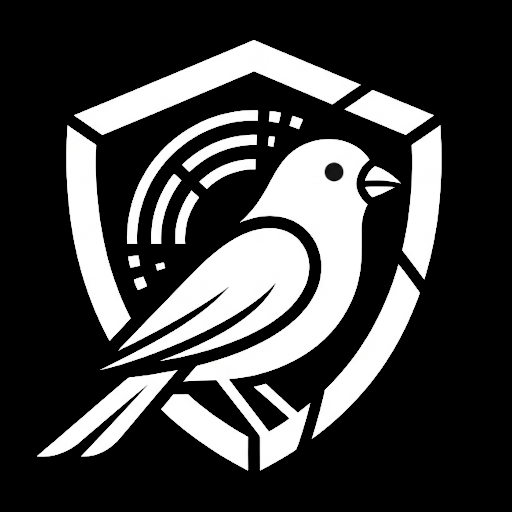
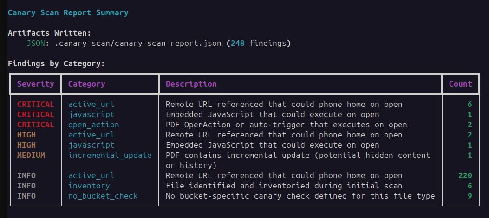
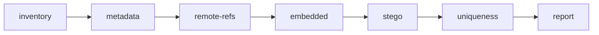

# PSA Intelligence Canary Scan 

[](https://pypi.org/project/canary-scan/)
[](https://github.com/psaintelligence/canary-scan/)
[](https://github.com/psaintelligence/canary-scan/actions/workflows/project-tests.yml)
[](https://github.com/psaintelligence/canary-scan)



**Scan document data-sources for canaries, trackers, web beacons, and per-recipient fingerprints before interacting with supplied datasets.**

When you receive a large document dump from an external party — a leak, legal disclosure, or investigation — those files and documents can contain deliberate or indirect canaries: tracking pixels, embedded JavaScript, remote template links, steganographic watermarks, or per-recipient metadata fingerprints that phone home the moment a file is opened.

`canary-scan` inspects files **without opening it in its native viewer**, extracting and analysing raw structure, metadata, embedded objects, and near-duplicate fingerprints to surface anything that may reveal to an external party that the data-source is being examined.

---

## Quick Start (Docker)

The primary and recommended way to run `canary-scan` is using Docker, which comes pre-bundled with all system dependencies and utilities:

```bash
# Run the scan using the GitHub Container Registry image
docker run --rm \
  -v /mnt/datasource:/data:ro \
  -v $(pwd)/canary-scan-out:/output \
  ghcr.io/psaintelligence/canary-scan:latest scan /data -o /output

# Review findings
jq '.[] | select(.severity=="critical")' canary-scan-out/canary-scan-report.json
```

Run `canary-scan --guide` inside the container/local shell for a concise cheat sheet, or see the [Workflow guide](workflow.md) for a full walkthrough.

---

## Quick Start (pipx)

If you prefer to run the tool natively, you can install the Python package:

```bash
pipx install canary-scan
```

See the [Install guide](install.md) for required system dependencies, optional packages, and air-gapped environment setup.

---

## Canary Scan Report Summary



---

## Detection Pipeline

Seven sequential stages, each writing a JSONL artefact:



| Stage | What it checks |
|---|---|
| **inventory** | File walk, SHA-256 hashes, MIME types, bucket classification |
| **metadata** | exiftool extraction, tracking URLs, GPS/serial/PII indicators |
| **remote-refs** | XXE, tracking pixels, remote template links, formula injections, OLE hyperlinks |
| **embedded** | Nested binaries, OLE/ActiveX objects, raster image extraction |
| **stego** | Steghide/stegseek carrier checks, QR code URL detection, EXIF thumbnail mismatch |
| **uniqueness** | Near-duplicate clustering to find per-recipient canary values |
| **report** | Merge, deduplicate, filter by severity, emit JSON/CSV/SARIF |

See [File Types](file-types.md) for the full matrix of supported formats and canary vectors.

---

## Severity Levels

| Severity | Meaning | Recommended Action |
|---|---|---|
| **critical** | Active phone-home URL or JS that fires on open | Do NOT open in native viewer — quarantine |
| **high** | Embedded OLE/JS objects, steganographic payload | Investigate in an isolated sandbox |
| **medium** | Unique fingerprint, GPS/PII metadata | Strip metadata before further handling |
| **low** | Metadata oddity, non-standard producer string | Note for chain of custody |
| **info** | Annotated — no canary confirmed | Informational only |
